  

  <em>Building ML-powered products, reliable infrastructure, and clean interfaces — end to end.</em>

  &nbsp;
  &nbsp;
  

---

  
  
  
  
  
  
  
  

---

  
   
  Commit activity — auto-generated daily

