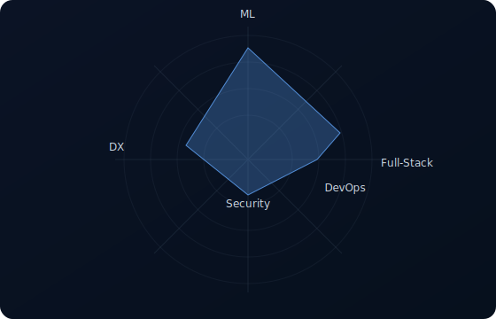

### Hi, I'm Aidan Tran — Software Engineer (ML • Full‑Stack • DevOps)

I build ML‑powered products, reliable cloud infrastructure, and delightful UIs — end‑to‑end. I ship production systems with strong observability, automation, and DX.

#### What I do

- **ML + MLOps**: PyTorch/TensorFlow models; FastAPI/Flask model serving; GPU pipelines; observability with Elastic; automation with Ansible.
- **Full‑Stack**: React/TypeScript frontends; Node.js/Express backends; SQL/Postgres; auth; realtime; clean API design.
- **DevOps**: Docker + OpenShift/Kubernetes; CI/CD; infra as code; on‑call and runbook automation; performance and security hardening.

  

#### Tech I use

---

  
   
  <em>Built with pure SVG — a nod to retro games and low‑level graphics</em>
 

### By the numbers

> Self‑reported focus: quality over quantity — tests, observability, and performance are non‑negotiable.

  

---

---

### Contact

- Email: `aidantran120@gmail.com`
- LinkedIn: `linkedin.com/in/aidantran120/`
- GitHub: `github.com/AidanHT`

— Open to SWE/ML/Full‑Stack/DevOps roles. Let’s build something great.
