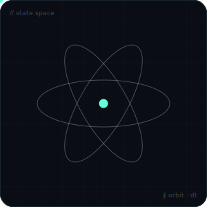

<!--
  Aidan Tran · GitHub profile README
  Art is generated by gen.py into /assets (self-contained animated SVGs).
  To tweak colours/shapes, edit gen.py and re-run:  python gen.py
  Everything below is plain Markdown + a little HTML that GitHub allows.
  Edit the prose freely — the < !-- EDIT --> markers show the personal bits.
-->

<div align="center">

<a href="https://aidanht.me">
  
</a>

<br><br>

<a href="https://aidanht.me"></a>
&nbsp;
<a href="https://www.linkedin.com/in/aidantran120"></a>
&nbsp;
<a href="https://x.com/AidanHTran"></a>

</div>

---

<table>
<tr>
<td width="360" valign="middle">


</td>
<td valign="middle">

### `> ` hello, world.

I like problems that look like geometry once you squint —
**math**, **systems**, and the **interfaces** that make them legible.

```text
∂(curiosity)/∂t  >  0
status .......... shipping & learning
compiles on ..... coffee + clean abstractions
```

<!-- EDIT: make the two lines above yours -->

</td>
</tr>
</table>

<details>
<summary><b><code>$ whoami --verbose</code></b></summary>

<br>

```text
name      Aidan Tran
fields    mathematics · software · design systems
building  small, sharp tools that feel inevitable
reading   anything where a picture finishes the proof
mantra    make it correct, then make it obvious
```

<!-- EDIT: this is your bio block -->

</details>

<details>
<summary><b><code>∮ rotate the manifold</code></b> — peek at another solid</summary>

<br>

<div align="center">
  
  <br>
  <sub>three great circles, one fixed point — <i>angular momentum wants to be left alone.</i></sub>
</div>

</details>

<details>
<summary><b><code>λ choose a trajectory</code></b></summary>

<br>

> Pick a direction and the geodesic will take you there:

- &nbsp;**◢**&nbsp; work & writing → [aidanht.me](https://aidanht.me)
- &nbsp;**◣**&nbsp; the long-form me → [linkedin.com/in/aidantran120](https://www.linkedin.com/in/aidantran120)
- &nbsp;**◤**&nbsp; thoughts in 280 chars → [@AidanHTran](https://x.com/AidanHTran)

</details>

<br>

<div align="center">


<sub><code>constructed with straightedge, compass &amp; a little SMIL</code> · <code>χ = V − E + F = 2</code></sub>

</div>
